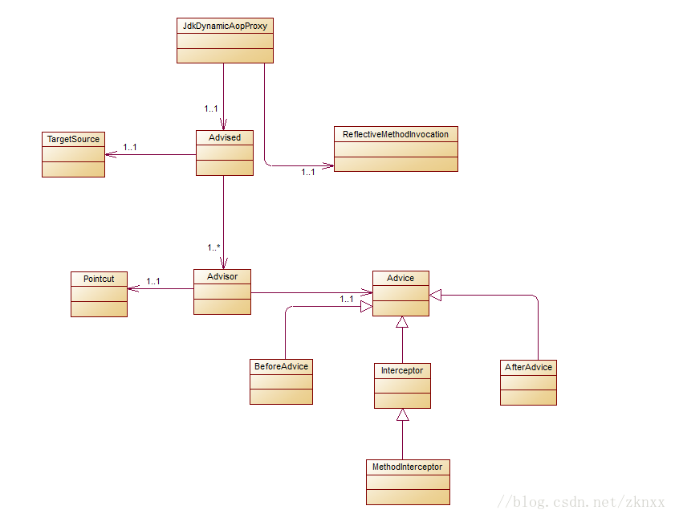

终于要正式开始SpringAOP的分析工作了，在这之前先问个问题：关于AOP你认为最重要的是哪几个地方？我觉得有这样几个地方(理解的不对的地方欢迎指出)：一个是AOP的配置(拦截规则的配置)，一个是代理对象的创建，一个是统一的拦截调用过程。关于AOP的配置Spring是自己定义了一套规则同时集成了AspectJ的语法，抽象为了Pointcut类。代理对象的创建，SpringAOP定义了一个工厂类AopProxy，同时支持JDK动态代理和CGlib动态代理。统一的拦截调用过程则是使用了AOP联盟中定义的拦截过程：Advice----->Interceptor------->MethodInterceptor。但是SpringAOP在这个基础上做了一些扩展，形成了自己的一套体系。接下来先介绍一下长得很像三胞胎的三个类：
Advice：SpringAOP联盟中定义的类。是一个标识性的接口。通知类型的接口。同时也是Interceptor、MethodInterceptor的父类。通知类型都有去实现的一个接口。
Advisor：关联了Advice和Pointcut。在SpringAOP中是一个很关键的类。上起到了连接点的匹配下起到了通知类型的调用。统一了拦截的调用过程。
Advised：关联了Advisor和TargetSource的类。也是AOP中一个很关键的类。AOP进行方法拦截的时候，就是从它里面获取的拦截调用链。
一个大致的关系如下：

下面我们先写一个使用SpringAOP的小例子，这里使用了AspectJ中的语法。小例子如下：
先定义一个切面类和一个前置通知：
```java
@Aspect
public class AopAdviceConfig {

    @Before("execution(* com.zkn.spring.learn.aop.program.service..*.*(..))")
    public void beforeAdvice(JoinPoint joinPoint) {
        System.out.println(joinPoint.getThis());
        System.out.println("我是前置通知....");
    }
}
//定义一个接口
public interface AspectJService {

    /**
     * 测试前置通知
     */
    void beforeAdvice();

    /**
     * 测试后置通知
     */
    void afterAdvice();
}
//实现类
public class AspectJServiceImpl implements AspectJService {

    @Override
    public void beforeAdvice() {
        System.out.println("测试前置通知，我是第一个Service。。。。。。");
    }

    /**
     * 测试后置通知
     */
    @Override
    public void afterAdvice() {
        System.out.println("测试AspectJ后置通知。。。。");
    }
}
```
我们用编程的方式去进行一个AOP的拦截功能。
```java
public class AspectJProxyFactoryLearn {

    public static void main(String[] args) {
        //手工创建一个实例
        AspectJService aspectJService = new AspectJServiceImpl();
        //使用AspectJ语法 自动创建代理对象
        AspectJProxyFactory aspectJProxyFactory = new AspectJProxyFactory(aspectJService);
        //添加切面和通知类
        aspectJProxyFactory.addAspect(AopAdviceConfig.class);
        //创建代理对象
        AspectJService proxyService = aspectJProxyFactory.getProxy();
        //进行方法调用
        proxyService.beforeAdvice();
    }
}
```
我们看一下输出结果：

从上面的输出结果来看，我们的AOP拦截功能是生效了。但是对于这样的操作你可能会很奇怪，感觉SpringAOP还能这样玩？上面的AspectJProxyFactory这个类又是什么鬼？怎么只调用了一下addAspect方法，然后调用getProxy方法生成代理对象，这样就能进行AOP拦截了？我们在下面的文章中慢慢为你解谜。
在进行AspectJProxyFactory分析之前先来看一下AspectJProxyFactory的UML类图：

AspectJProxyFactory的类图如上所示，我们可以看到它是Advised的一个子类。先把这个图印在脑子里。我们先来看第一段代码：
```java
AspectJProxyFactory aspectJProxyFactory = new AspectJProxyFactory(aspectJService);
//对应的AspectJProxyFactory构造函数的内容
public AspectJProxyFactory(Object target) {
	Assert.notNull(target, "Target object must not be null");
	setInterfaces(ClassUtils.getAllInterfaces(target));
	setTarget(target);
}
```
当我们调用AspectJProxyFactory的有参构造函数时，它做了这几件事，检测目标对象不能为null，设置目标对象的所有的接口，设置目标对象。
获取类上的所有的接口是通过调用ClassUtils.getAllInterfaces来获取的。**这个方法可以获取类上的所有接口，包括父类上的接口，但是它不能获取接口的接口**。意思是如果：类A继承了类B，类B实现了接口C，接口C继承了接口D，如果传入的参数是类A，**这里是可以获取到接口C，但是获取不到接口D的**。
```java
	//AdvisedSupport中添加接口信息
	public void setInterfaces(Class<?>... interfaces) {
		Assert.notNull(interfaces, "Interfaces must not be null");
		//先清空原来的接口信息 是一个List
		this.interfaces.clear();
		for (Class<?> ifc : interfaces) {
			addInterface(ifc);
		}
	}
	//AdvisedSupport中的方法
	public void addInterface(Class<?> intf) {
		Assert.notNull(intf, "Interface must not be null");
		//如果不是接口 抛出异常
		if (!intf.isInterface()) {
			throw new IllegalArgumentException("[" + intf.getName() + "] is not an interface");
		}
		if (!this.interfaces.contains(intf)) {
			this.interfaces.add(intf);
			adviceChanged();
		}
	}
	//ProxyCreatorSupport中的方法
	protected void adviceChanged() {
		super.adviceChanged();
		synchronized (this) {
			if (this.active) {
				//给Advised的监听器发送通知 通知Advised的变化 
				//在Spring中没有默认的实现
				for (AdvisedSupportListener listener : this.listeners) {
					listener.adviceChanged(this);
				}
			}
		}
	}
	//AdvisedSupport中的方法
	protected void adviceChanged() {
		//清空缓存的方法信息 这里可以思考一下为什么当Interface变化的时候，会清空methodCache
		//Map<MethodCacheKey, List<Object>> methodCache
		//为什么这个类名是adviceChanged？？？
		this.methodCache.clear();
	}
```
设置目标对象
```java
	public void setTarget(Object target) {
		//注意这里是将目标对象封装为了 SingletonTargetSource 是一个单例的
		//这里一定要记着 SingletonTargetSource中存放的是我们的目标对象 不是代理对象
		//这里调用的是AdvisedSupport中的方法 setTargetSource这个方法是Advised中定义的方法
		setTargetSource(new SingletonTargetSource(target));
	}
	// AdvisedSupport
	public void setTargetSource(TargetSource targetSource) {
		this.targetSource = (targetSource != null ? targetSource : EMPTY_TARGET_SOURCE);
	}
```
剩下的我们在下一章分析。
