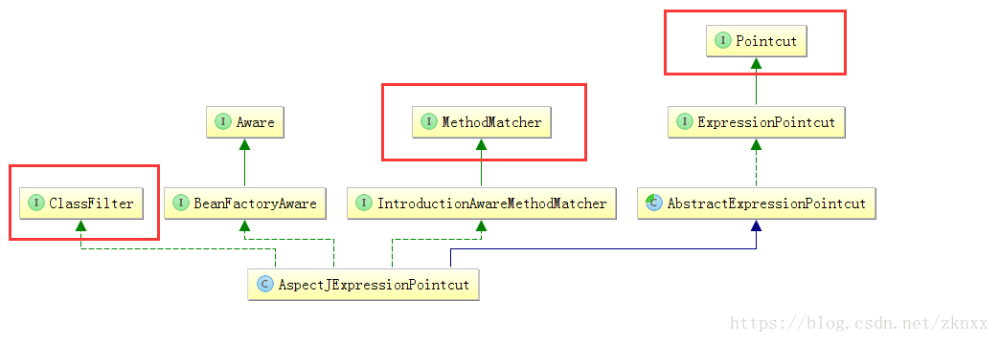

我们在这一章中继续上一章的分析。我们在上一章中说到了获取到了切面类中所有不带@Pointcut注解的方法，我们看看Spring对我们获取到的这些方法进行了什么操作：
```java
for (Method method : getAdvisorMethods(aspectClass)) {
	//循环切面中所有不带@Pointcut注解的方法。 
	//method 切面中不带@Pointcut注解的方法
	//lazySingletonAspectInstanceFactory中含有切面实例 是个单例
	//advisors中的下标 切面的一个顺序
	//aspectName 切面类的名字
	//下面我们来看一下getAdvisor这个方法的内容
	Advisor advisor = getAdvisor(method, lazySingletonAspectInstanceFactory, advisors.size(), aspectName);
	if (advisor != null) {
		advisors.add(advisor);
	}
}
```
getAdvisor
```java
	public Advisor getAdvisor(Method candidateAdviceMethod, MetadataAwareAspectInstanceFactory aspectInstanceFactory,
			int declarationOrderInAspect, String aspectName) {
		//验证切面类 见我们上一章的分析
		validate(aspectInstanceFactory.getAspectMetadata().getAspectClass());
		//这里根据传入的方法和切面类获取 切点表达式
		AspectJExpressionPointcut expressionPointcut = getPointcut(
				candidateAdviceMethod, aspectInstanceFactory.getAspectMetadata().getAspectClass());
		//没有获取到切点表达式 直接返回null
		if (expressionPointcut == null) {
			return null;
		}
		//返回一个Advisor的实例 这个实例中包含了 一下内容
		//切点表达式 AspectJExpressionPointcut 
		//切点方法 
		//ReflectiveAspectJAdvisorFactory实例
		//切面类实例
		//切面类名字
		return new InstantiationModelAwarePointcutAdvisorImpl(expressionPointcut, candidateAdviceMethod,
				this, aspectInstanceFactory, declarationOrderInAspect, aspectName);
	}
```
我们先来看一下AspectJExpressionPointcut这个类的UML类图：

**在AspectJExpressionPointcut这个类中主要实现了以下这四大接口：ClassFilter、BeanFactoryAware、MethodMatcher、Pointcut**。Pointcut是SpringAOP中定义的接口，用来表示切面的抽象。BeanFactoryAware也是SpringIOC中一个常见的接口，用来设置BeanFactory实例。ClassFilter和MethodMatcher是SpringAOP中定义的进行Advisor匹配的接口。ClassFilter用来此Advisor是否使用于目标类。MethodMatcher用来匹配此Advisor是否可以作用于目标类中的目标方法。那么AspectJExpressionPointcut这个类就拥有了一下功能：从BeanFactory中获取Bean、拥有切点表达式、可以用来判断此切点表达式方法是否适用于目标类、此切点表达式方法是否适用于目标类中的方法。OK，我们继续看生成AspectJExpressionPointcut的过程。
```java
	private AspectJExpressionPointcut getPointcut(Method candidateAdviceMethod, Class<?> candidateAspectClass) {
		//方法上是否存在切面注解(通知类型注解) 即方法上是否有
		//@Before, @Around, @After, @AfterReturning, @AfterThrowing, @Pointcut注解
		//这里也提供了一种获取类上是否有我们想要的注解的一种方式
		//返回一个AspectJAnnotation对象
		//这里用了AnnotationUtils用来获取注解的相关信息
		AspectJAnnotation<?> aspectJAnnotation =
				AbstractAspectJAdvisorFactory.findAspectJAnnotationOnMethod(candidateAdviceMethod);
		if (aspectJAnnotation == null) {
			return null;
		}
		//创建AspectJExpressionPointcut对象
		AspectJExpressionPointcut ajexp =
				new AspectJExpressionPointcut(candidateAspectClass, new String[0], new Class<?>[0]);
		//设置切面表达式 在AspectJAnnotation中是可以获取到通知类型的，但是这里没有设置通知类型
		ajexp.setExpression(aspectJAnnotation.getPointcutExpression());
		ajexp.setBeanFactory(this.beanFactory);
		return ajexp;
	}
``` 
在这里我们要看一下AspectJAnnotation这个类。这个类是AbstractAspectJAdvisorFactory中的内部类。从这个类中可以获取切点表达式和通知类型。
```java
	protected static class AspectJAnnotation<A extends Annotation> {
		//切点表达式所在的属性  poincut会覆盖value的值 
		//其实这里指的是 通知类型注解中的属性
		private static final String[] EXPRESSION_PROPERTIES = new String[] {"value", "pointcut"};

		private static Map<Class<?>, AspectJAnnotationType> annotationTypes =
				new HashMap<Class<?>, AspectJAnnotationType>();

		static {
			//初始化通知类型
			annotationTypes.put(Pointcut.class,AspectJAnnotationType.AtPointcut);
			annotationTypes.put(After.class,AspectJAnnotationType.AtAfter);
			annotationTypes.put(AfterReturning.class,AspectJAnnotationType.AtAfterReturning);
			annotationTypes.put(AfterThrowing.class,AspectJAnnotationType.AtAfterThrowing);
			annotationTypes.put(Around.class,AspectJAnnotationType.AtAround);
			annotationTypes.put(Before.class,AspectJAnnotationType.AtBefore);
		}
		.......
		public AspectJAnnotation(A annotation) {
			//注解信息
			this.annotation = annotation;
			//根据注解类型获取通知类型
			this.annotationType = determineAnnotationType(annotation);
			// We know these methods exist with the same name on each object,
			// but need to invoke them reflectively as there isn't a common interface.
			try {
				//从通知类型注解上面获取切点表达式
				this.pointcutExpression = resolveExpression(annotation);
				//获取参数的名字
				this.argumentNames = (String) annotation.getClass().getMethod("argNames").invoke(annotation);
			}
			catch (Exception ex) {
				throw new IllegalArgumentException(annotation + " cannot be an AspectJ annotation", ex);
			}
		}
		//从这个获取切点表达式的代码中我们可以看到 pointcut的属性会覆盖value的属性值
		private String resolveExpression(A annotation) throws Exception {
			String expression = null;
			//循环上面的切点属性
			for (String methodName : EXPRESSION_PROPERTIES) {
				Method method;
				try {
					method = annotation.getClass().getDeclaredMethod(methodName);
				}
				catch (NoSuchMethodException ex) {
					method = null;
				}
				if (method != null) {
					//获取切点表达式！！！
					String candidate = (String) method.invoke(annotation);
					if (StringUtils.hasText(candidate)) {
						expression = candidate;
					}
				}
			}
			return expression;
		}
```
**我们把上面获取Advisor的过程总结一下：循环切面类中的所有不带@Pointcut注解的方法，接着判断切面类的方法上是否有：@Before, @Around, @After, @AfterReturning, @AfterThrowing, @Pointcut注解。如果没有的话，循环下一个方法。如果有这些注解的话，则从这些注解中获取切点表达式存放到AspectJExpressionPointcut对象中，最后将获取到的切点表达式类封装到InstantiationModelAwarePointcutAdvisorImpl这个类中**。从上面的分析我们知道InstantiationModelAwarePointcutAdvisorImpl类至少拥有：切点表达式类、切面对象、带有切点表达式的方法、ReflectiveAspectJAdvisorFactory实例。那么我们最后来分析一下InstantiationModelAwarePointcutAdvisorImpl这个类。
```java
	public InstantiationModelAwarePointcutAdvisorImpl(AspectJExpressionPointcut declaredPointcut,
			Method aspectJAdviceMethod, AspectJAdvisorFactory aspectJAdvisorFactory,
			MetadataAwareAspectInstanceFactory aspectInstanceFactory, int declarationOrder, String aspectName) {
		//切点表达式类 AspectJExpressionPointcut 
		this.declaredPointcut = declaredPointcut;
		//切面类 
		this.declaringClass = aspectJAdviceMethod.getDeclaringClass();
		//切点表达式方法所在的方法名 这里指的是@Before、@After这些通知类型所在的方法名
		this.methodName = aspectJAdviceMethod.getName();
		//通知参数类型
		this.parameterTypes = aspectJAdviceMethod.getParameterTypes();
		//切面通知方法
		this.aspectJAdviceMethod = aspectJAdviceMethod;
		//ReflectiveAspectJAdvisorFactory实例
		this.aspectJAdvisorFactory = aspectJAdvisorFactory;
		//切面对象实例
		this.aspectInstanceFactory = aspectInstanceFactory;
		//切面顺序
		this.declarationOrder = declarationOrder;
		this.aspectName = aspectName;
		//根据切面元数据判断是否要延迟实例化 一般为否
		if (aspectInstanceFactory.getAspectMetadata().isLazilyInstantiated()) {
			// Static part of the pointcut is a lazy type.
			Pointcut preInstantiationPointcut = Pointcuts.union(
					aspectInstanceFactory.getAspectMetadata().getPerClausePointcut(), this.declaredPointcut);
			this.pointcut = new PerTargetInstantiationModelPointcut(
					this.declaredPointcut, preInstantiationPointcut, aspectInstanceFactory);
			this.lazy = true;
		}
		else {
			// A singleton aspect.
			//切点表达式类
			this.pointcut = this.declaredPointcut;
			this.lazy = false;
			//这里获取Advice实例 这里又拥有了Advice的实例！！！！
			//不得不说InstantiationModelAwarePointcutAdvisorImpl这个类真的是太强大了
			this.instantiatedAdvice = instantiateAdvice(this.declaredPointcut);
		}
	}
```
OK下面我们的分析就到了如果从InstantiationModelAwarePointcutAdvisorImpl中获取Advice的内容。
