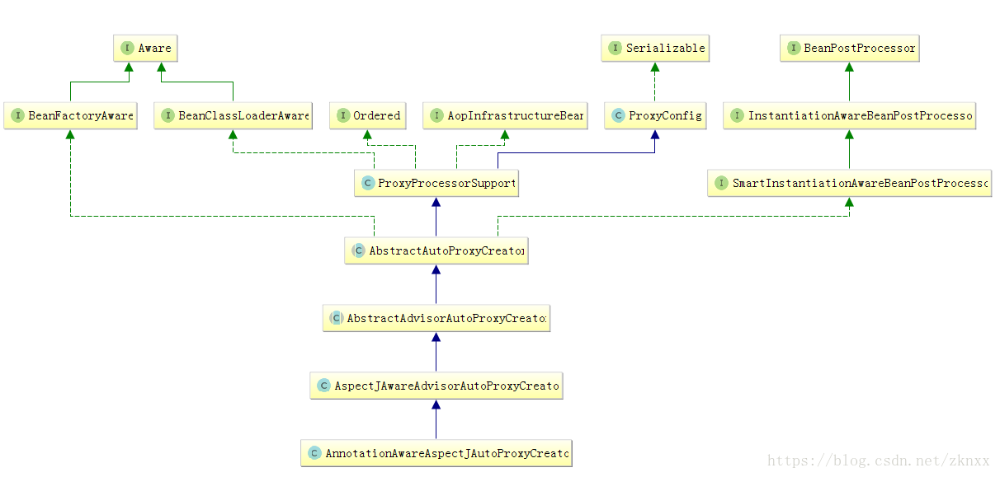

转载请注明出处：https://blog.csdn.net/zknxx/article/details/80725173
我们在这篇文章中来分析一下AnnotationAwareAspectJAutoProxyCreator这个类，看这个类的名字我们大概可以知道它主要是为AspectJ注解提供服务的类。这个类不得了了是一个相当厉害的类，在这个类中可以识别应用中的所有切面类，为目标类找寻合适的Advisor，将目标类变为代理类等功能。话不多说了，下面我们来简单的分析一下这个类。
首先我们来看一下这个类的类图：

从上面的图中我们可以看到AnnotationAwareAspectJAutoProxyCreator这个类间接实现了BeanFactoryAware、BeanClassLoaderAware、Ordered、BeanPostProcessor接口。如果之前没有了解过Spring Bean的生命周期(或者是Spring开放的对Bean进行修改的扩展接口)的话，请点击这里查看（[Spring Bean的生命周期小析(一)](https://blog.csdn.net/zknxx/article/details/72594300)  和   [Spring Bean的生命周期小析(二)](https://blog.csdn.net/zknxx/article/details/72599147)）这里就不再多说了。上面提到的接口的实现类大多是在AbstractAutoProxyCreator这个类中实现的。Spring提供的这些关于Bean的扩展接口大大方便了我们在Bean的创建过程中对Bean进行一些修改的操作。我们按照顺序来看看AnnotationAwareAspectJAutoProxyCreator这个关系链上对这些接口的实现。
#### AbstractAdvisorAutoProxyCreator#setBeanFactory
```
	@Override
	public void setBeanFactory(BeanFactory beanFactory) {
		//掉用父类的setBeanFactory 这里只是一个简单的赋值
		super.setBeanFactory(beanFactory);
		//如果BeanFactory不是ConfigurableListableBeanFactory类型的 抛出异常
		if (!(beanFactory instanceof ConfigurableListableBeanFactory)) {
			throw new IllegalArgumentException(
					"AdvisorAutoProxyCreator requires a ConfigurableListableBeanFactory: " + beanFactory);
		}
		//初始化BeanFactory
		initBeanFactory((ConfigurableListableBeanFactory) beanFactory);
	}
	//这个方法在AnnotationAwareAspectJAutoProxyCreator这个类型中
	@Override
	protected void initBeanFactory(ConfigurableListableBeanFactory beanFactory) {
		//调用父类的initBeanFactory 执行的内容如下：
		//this.advisorRetrievalHelper = new BeanFactoryAdvisorRetrievalHelperAdapter(beanFactory);
		//创建BeanFactoryAdvisorRetrievalHelperAdapter 从BeanFactory中获取Advisor类型的Bean
		super.initBeanFactory(beanFactory);
		if (this.aspectJAdvisorFactory == null) {
			//创建ReflectiveAspectJAdvisorFactory 相当重要的一个类
			this.aspectJAdvisorFactory = new ReflectiveAspectJAdvisorFactory(beanFactory);
		}
		//创建BeanFactoryAspectJAdvisorsBuilderAdapter 相当重要的一个类
		//为目标类型创建对应的Advisor的类
		this.aspectJAdvisorsBuilder =
				new BeanFactoryAspectJAdvisorsBuilderAdapter(beanFactory, this.aspectJAdvisorFactory);
	}
```
#### AbstractAutoProxyCreator#postProcessBeforeInstantiation
这个方法可以让我们在Bean被Spring容器实例化之前提前创建Bean，如果这个方法返回的值不是null，那就中断其他类对这个接口的实现，直接返回这个创建的Bean。在AbstractAutoProxyCreator中其源码如下：
```
	public Object postProcessBeforeInstantiation(Class<?> beanClass, String beanName) throws BeansException {
		//得到一个缓存的key 实现是：如果是beanClass是FactoryBean类型，则在beanName前面加&
		Object cacheKey = getCacheKey(beanClass, beanName);
		//如果目标Bean的集合中包这个beanName的话 则跳过
		if (beanName == null || !this.targetSourcedBeans.contains(beanName)) {
			if (this.advisedBeans.containsKey(cacheKey)) {
				return null;
			}
			//isInfrastructureClass 判断是不是负责AOP基础建设的Bean，如果是AOP基础建设的Bean不能在这里被创建代理对象
			//那么什么样的Bean是AOP的基础建设Bean呢？Advice、Pointcut、Advisor、AopInfrastructureBean类型的Bean
			//以及含有Aspect注解的Bean
			//shouldSkip这个方法是判断这个类型的Bean能不能被跳过，如果可以跳过，那么就不提前创建这个类
			//这个类我们在下面详细分析
			if (isInfrastructureClass(beanClass) || shouldSkip(beanClass, beanName)) {
				//缓存这个beanClass
				this.advisedBeans.put(cacheKey, Boolean.FALSE);
				return null;
			}
		}
		/ Create proxy here if we have a custom TargetSource.
		// Suppresses unnecessary default instantiation of the target bean:
		// The TargetSource will handle target instances in a custom fashion.
		if (beanName != null) {
			//一般我们都是不配置TargetSourceCreator 下面的步骤我们先跳过 在后面我们还会继续分析下面的内容的
			TargetSource targetSource = getCustomTargetSource(beanClass, beanName);
			if (targetSource != null) {
				this.targetSourcedBeans.add(beanName);
				Object[] specificInterceptors = getAdvicesAndAdvisorsForBean(beanClass, beanName, targetSource);
				Object proxy = createProxy(beanClass, beanName, specificInterceptors, targetSource);
				this.proxyTypes.put(cacheKey, proxy.getClass());
				return proxy;
			}
		}
```
#### AspectJAwareAdvisorAutoProxyCreator#shouldSkip
```
	protected boolean shouldSkip(Class<?> beanClass, String beanName) {
		// TODO: Consider optimization by caching the list of the aspect names
		//我们重点看到是findCandidateAdvisors这个方法的内容
		//查找所有可选择对的Advisor 并且或进行缓存
		List<Advisor> candidateAdvisors = findCandidateAdvisors();
		for (Advisor advisor : candidateAdvisors) {
			if (advisor instanceof AspectJPointcutAdvisor) {
				//如果AbstractAspectJAdvice类型的Advice中有aspectName和beanName相等则跳过
				if (((AbstractAspectJAdvice) advisor.getAdvice()).getAspectName().equals(beanName)) {
					return true;
				}
			}
		}
		//父类直接返回一个false
		return super.shouldSkip(beanClass, beanName);
	}
```
##### AnnotationAwareAspectJAutoProxyCreator#findCandidateAdvisors
```
	@Override
	protected List<Advisor> findCandidateAdvisors() {
		// Add all the Spring advisors found according to superclass rules.
		// 同样是先调用父类的findCandidateAdvisors
		List<Advisor> advisors = super.findCandidateAdvisors();
		// Build Advisors for all AspectJ aspects in the bean factory.
		//构建所有切面Bean中的Advisor
		//很重要的一个方法 下面分析
		advisors.addAll(this.aspectJAdvisorsBuilder.buildAspectJAdvisors());
		return advisors;
	}
	// AbstractAdvisorAutoProxyCreator#findCandidateAdvisors
	protected List<Advisor> findCandidateAdvisors() {
		//这个advisorRetrievalHelper 就是我们在 initBeanFactory中创建的BeanFactoryAdvisorRetrievalHelper
		return this.advisorRetrievalHelper.findAdvisorBeans();
	}
	
	// BeanFactoryAdvisorRetrievalHelper#findAdvisorBeans
	//这个方法的内容是从Spring容器中获取Advisor类型的Bean
	public List<Advisor> findAdvisorBeans() {
		// Determine list of advisor bean names, if not cached already.
		String[] advisorNames = null;
		synchronized (this) {
			//先看看之前是不是缓存过
			advisorNames = this.cachedAdvisorBeanNames;
			if (advisorNames == null) {
				// Do not initialize FactoryBeans here: We need to leave all regular beans
				// uninitialized to let the auto-proxy creator apply to them!
				//上面的注释说的很清楚 这里不会初始化FactoryBean 为什么会这样说呢？因为提前导致FactoryBean类型的Bean被创建的话是会有问题的
				//从BeanFactory中获取所有的Advisor类型的Bean
				advisorNames = BeanFactoryUtils.beanNamesForTypeIncludingAncestors(
						this.beanFactory, Advisor.class, true, false);
				//这里进行赋值缓存
				this.cachedAdvisorBeanNames = advisorNames;
			}
		}
		//如果没有Advisor类型的Bean的话 直接返回
		//如果你有特殊需求的话 可以实现Advisor接口，并向Spring容器中注入对应的Bean
		if (advisorNames.length == 0) {
			return new LinkedList<Advisor>();
		}
		//这里是默认创建了一个 Advisor类型的集合 
		List<Advisor> advisors = new LinkedList<Advisor>();
		for (String name : advisorNames) {
			//这里默认返回的是true
			if (isEligibleBean(name)) {
				//如果是正在创建中的Bean 则跳过
				if (this.beanFactory.isCurrentlyInCreation(name)) {
					if (logger.isDebugEnabled()) {
						logger.debug("Skipping currently created advisor '" + name + "'");
					}
				}
				else {
					try {
						//从BeanFactory中获取对应的Bean 这里如果Bean还没创建 会导致Bean创建
						advisors.add(this.beanFactory.getBean(name, Advisor.class));
					}
					catch (BeanCreationException ex) {
					//异常处理 略
					}
				}
			}
		}
		return advisors;
	}
```
下面我们来看看BeanFactoryAspectJAdvisorsBuilder#buildAspectJAdvisors中的这个方法，从名字我们就可以看出来这是一个从BeanFactory中构建Advisor的方法。
```
	public List<Advisor> buildAspectJAdvisors() {
		//所有的切面的名字 这里的处理逻辑和上面的是一样的 获取到所有的切面BeanName之后缓存起来 volatile类型的
		List<String> aspectNames = this.aspectBeanNames;
		if (aspectNames == null) {
			synchronized (this) {
				//这里又赋值了一次  看着这个逻辑是不是和某个单例的写法很像啊？
				aspectNames = this.aspectBeanNames;
				if (aspectNames == null) {
					List<Advisor> advisors = new LinkedList<Advisor>();
					aspectNames = new LinkedList<String>();
					//这里是从BeanFactory中获取所有的Bean
					String[] beanNames = BeanFactoryUtils.beanNamesForTypeIncludingAncestors(
							this.beanFactory, Object.class, true, false);
					for (String beanName : beanNames) {
						//这里默认都是true
						if (!isEligibleBean(beanName)) {
							continue;
						}
						// We must be careful not to instantiate beans eagerly as in this case they
						// would be cached by the Spring container but would not have been weaved.
						//注意看上面这个注释的内容：在这个场景下我们获取BeanClass的时候必须要小心处理，以免会提前初始化
						//Bean，这些Bean在初始化之后会被Spring容器缓存起来，但是这些Bean可能还没有被织入。
						Class<?> beanType = this.beanFactory.getType(beanName);
						if (beanType == null) {
							continue;
						}
						//判断上面获取到的BeanClass是否带有Aspect注解
						if (this.advisorFactory.isAspect(beanType)) {
							//添加到 aspectNames中
							aspectNames.add(beanName);
							//创建切面元数据 这部门的内容和我们之前分析大致差不多 我们就不再详细分析了
							//请看这里： https://blog.csdn.net/zknxx/article/details/79685290
							AspectMetadata amd = new AspectMetadata(beanType, beanName);
							if (amd.getAjType().getPerClause().getKind() == PerClauseKind.SINGLETON) {
								//注意这里放入了 BeanFactory的引用 方便后面从BeanFactory中获取切面的实例
								MetadataAwareAspectInstanceFactory factory =
										new BeanFactoryAspectInstanceFactory(this.beanFactory, beanName);
								List<Advisor> classAdvisors = this.advisorFactory.getAdvisors(factory);
								//如果是单例的 缓存起来
								if (this.beanFactory.isSingleton(beanName)) {
									this.advisorsCache.put(beanName, classAdvisors);
								}
								else {
									this.aspectFactoryCache.put(beanName, factory);
								}
								advisors.addAll(classAdvisors);
							}
							else {
								// Per target or per this.
								if (this.beanFactory.isSingleton(beanName)) {
									throw new IllegalArgumentException("Bean with name '" + beanName +
											"' is a singleton, but aspect instantiation model is not singleton");
								}
								//这里使用的是 PrototypeAspectInstanceFactory
								MetadataAwareAspectInstanceFactory factory =
										new PrototypeAspectInstanceFactory(this.beanFactory, beanName);
								this.aspectFactoryCache.put(beanName, factory);
								advisors.addAll(this.advisorFactory.getAdvisors(factory));
							}
						}
					}
					this.aspectBeanNames = aspectNames;
					return advisors;
				}
			}
		}

		if (aspectNames.isEmpty()) {
			return Collections.emptyList();
		}
		//下面这些就是从缓存中获取Advisor了
		List<Advisor> advisors = new LinkedList<Advisor>();
		for (String aspectName : aspectNames) {
			List<Advisor> cachedAdvisors = this.advisorsCache.get(aspectName);
			if (cachedAdvisors != null) {
				advisors.addAll(cachedAdvisors);
			}
			else {
				MetadataAwareAspectInstanceFactory factory = this.aspectFactoryCache.get(aspectName);
				advisors.addAll(this.advisorFactory.getAdvisors(factory));
			}
		}
		return advisors;
	}
```
总结起来findCandidateAdvisors这个方法的内容就是从Spring容器中获取所有Advisor类型的Bean和切面中所有带有通知注解的方法并将其封装为Advisor。那么其实我们在AbstractAutoProxyCreator的postProcessBeforeInstantiation方法中就获取到了Spring容器中的所有Advisor。
##### AbstractAutoProxyCreator#postProcessAfterInstantiation 
```
	//通常都是返回true
	@Override
	public boolean postProcessAfterInstantiation(Object bean, String beanName) {
		return true;
	}
```
#### AbstractAutoProxyCreator#postProcessPropertyValues
```
	@Override
	public PropertyValues postProcessPropertyValues(
			PropertyValues pvs, PropertyDescriptor[] pds, Object bean, String beanName) {
		//不做处理
		return pvs;
	}
```
#### AbstractAutoProxyCreator#postProcessBeforeInitialization
```
	@Override
	public Object postProcessBeforeInitialization(Object bean, String beanName) {
		//不做处理原样返回
		return bean;
	}
```
##### AbstractAutoProxyCreator#postProcessAfterInitialization
这个方法需要重点分析一下了
```
	public Object postProcessAfterInitialization(Object bean, String beanName) throws BeansException {
		  if (bean != null) {
			//获取缓存的key
			Object cacheKey = getCacheKey(bean.getClass(), beanName);
			//如果不是提前引用的Bean
			if (!this.earlyProxyReferences.contains(cacheKey)) {
				//如果需要的话 对传入的Bean进行包装
				return wrapIfNecessary(bean, beanName, cacheKey);
			}
		}
		return bean;
	}
	//这个方法的主要作用就是创建代理对象
	protected Object wrapIfNecessary(Object bean, String beanName, Object cacheKey) {
		//如果已经创建过了 
		if (beanName != null && this.targetSourcedBeans.contains(beanName)) {
			return bean;
		}
		//如果这里返回的是False的话 直接返回
		if (Boolean.FALSE.equals(this.advisedBeans.get(cacheKey))) {
			return bean;
		}
		//这里又判断了一次不再多说了、、、
		if (isInfrastructureClass(bean.getClass()) || shouldSkip(bean.getClass(), beanName)) {
			this.advisedBeans.put(cacheKey, Boolean.FALSE);
			return bean;
		}
		//getAdvicesAndAdvisorsForBean这个方法下面我们要重点说一下
		// Create proxy if we have advice.
		Object[] specificInterceptors = getAdvicesAndAdvisorsForBean(bean.getClass(), beanName, null);
		if (specificInterceptors != DO_NOT_PROXY) {
			this.advisedBeans.put(cacheKey, Boolean.TRUE);
			//创建代理对象  
			Object proxy = createProxy(
					bean.getClass(), beanName, specificInterceptors, new SingletonTargetSource(bean));
			this.proxyTypes.put(cacheKey, proxy.getClass());
			return proxy;
		}
		//如果不需要创建代理对象的话  这里缓存false
		this.advisedBeans.put(cacheKey, Boolean.FALSE);
		return bean;
	}
```
转载请注明出处：https://blog.csdn.net/zknxx/article/details/80725173