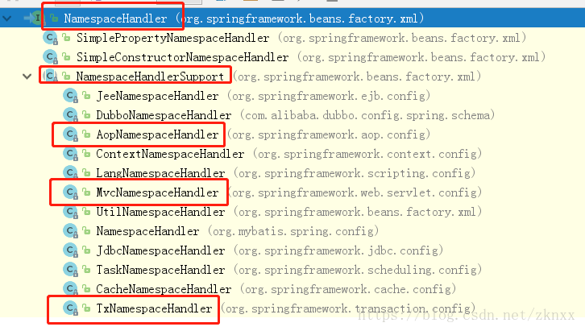
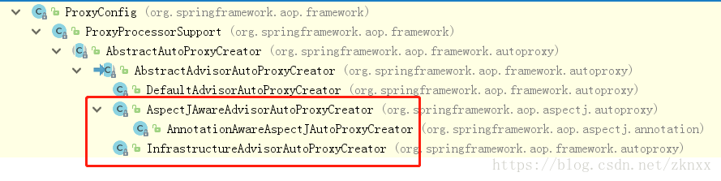

转载请注明出处：https://blog.csdn.net/zknxx/article/details/80724180
在开始这个系列之前大家先想一下我们是怎么在项目中使用SpringAOP的(这里的分析都是基于AspectJ注解的)。我们需要在我们的Spring配置文件中引入SpringAOP的命名空间和标签，然后定义切面Bean，进行AOP配置。大概如下所示：
```
<?xml version="1.0" encoding="UTF-8"?>
<beans xmlns="http://www.springframework.org/schema/beans"
       xmlns:xsi="http://www.w3.org/2001/XMLSchema-instance"
       xmlns:context="http://www.springframework.org/schema/context"
       <!--AOP的命名空间-->
       xmlns:aop="http://www.springframework.org/schema/aop"
       xsi:schemaLocation="http://www.springframework.org/schema/beans http://www.springframework.org/schema/beans/spring-beans.xsd
        http://www.springframework.org/schema/context
       http://www.springframework.org/schema/context/spring-context-4.3.xsd http://www.springframework.org/schema/aop http://www.springframework.org/schema/aop/spring-aop.xsd">
    <!--开启自动包扫描-->
    <context:component-scan base-package="com.zkn.spring.learn.aop.spring"/>
    <!--使用AspectJ注解-->
    <aop:aspectj-autoproxy/>
</beans>
```
我们在使用Spring中不同的功能的时候可能会引入不同的命名空间比如xmlns:context，xmlns:aop，xmlns:tx等等。关于命名空间的东西我们这里先不多说。在Spring中定义了一个这样的抽象类专门用来解析不同的命名空间。这个类是NamespaceHandler，我们看一下这个和这个类相关的一些子类：

在不同的命名空间实现类中定义了不同类型的实现类，这些实现类主要是用来初始化一些解析对应的标签的类。比如我们接下来要分析的AopNamespaceHandler这个类。在上面关于AOP的配置中，我们使用了一个AOP的标签：
```
<aop:aspectj-autoproxy/>
```
为什么我们只要使用这个标签，就可以使用SpringAOP的功能呢？看一下AopNamespaceHandler这个类的内容你就会明白了：
```
public class AopNamespaceHandler extends NamespaceHandlerSupport {

	@Override
	public void init() {
		// In 2.0 XSD as well as in 2.1 XSD.
		registerBeanDefinitionParser("config", new ConfigBeanDefinitionParser());
		//我们看到了这样的一段代码  aspectj-autoproxy这个再加上aop 是不是就是 aop:aspectj-autoproxy呢
		//这段代码的意思是使用AspectJAutoProxyBeanDefinitionParser来解析aop:aspectj-autoproxy标签
		//AspectJAutoProxyBeanDefinitionParser这个类就是SpringAOP和Spring框架结合的关键
		registerBeanDefinitionParser("aspectj-autoproxy", new AspectJAutoProxyBeanDefinitionParser());
		registerBeanDefinitionDecorator("scoped-proxy", new ScopedProxyBeanDefinitionDecorator());

		// Only in 2.0 XSD: moved to context namespace as of 2.1
		registerBeanDefinitionParser("spring-configured", new SpringConfiguredBeanDefinitionParser());
	}

}
```
PS：每个框架对应的NamespaceHandler就是你分析Spring中的对应框架的关键入口。
下面我们来分析一下AspectJAutoProxyBeanDefinitionParser这个类。先看一下它的parse方法。
```
	public BeanDefinition parse(Element element, ParserContext parserContext) {
		//这个地方是向ApplicationContext中注入使用AspectJ注解自动创建代理对象的bean
		AopNamespaceUtils.registerAspectJAnnotationAutoProxyCreatorIfNecessary(parserContext, element);
		extendBeanDefinition(element, parserContext);
		return null;
	}
```
AopNamespaceUtils#registerAspectJAnnotationAutoProxyCreatorIfNecessary的方法内容如下：
```
	public static void registerAspectJAnnotationAutoProxyCreatorIfNecessary(
			ParserContext parserContext, Element sourceElement) {
		//parserContext.getRegistry()这个是获取到的全局的BeanDefinitionRegistry
		//我们看这个方法做了什么
		BeanDefinition beanDefinition = AopConfigUtils.registerAspectJAnnotationAutoProxyCreatorIfNecessary(
				parserContext.getRegistry(), parserContext.extractSource(sourceElement));
		//这两个方法的内容一看就知道是什么意思了 就先不分析了
		useClassProxyingIfNecessary(parserContext.getRegistry(), sourceElement);
		registerComponentIfNecessary(beanDefinition, parserContext);
	}
```
AopConfigUtils#registerAspectJAnnotationAutoProxyCreatorIfNecessary  
``` 
	public static BeanDefinition registerAspectJAnnotationAutoProxyCreatorIfNecessary(BeanDefinitionRegistry registry, Object source) 	{
		//这里传入了一个AnnotationAwareAspectJAutoProxyCreator的class
		return registerOrEscalateApcAsRequired(AnnotationAwareAspectJAutoProxyCreator.class, registry, source);
	}
	
	private static BeanDefinition registerOrEscalateApcAsRequired(Class<?> cls, BeanDefinitionRegistry registry, Object source) {
		Assert.notNull(registry, "BeanDefinitionRegistry must not be null");
		//这里先判断是不是已经注入过name为org.springframework.aop.config.internalAutoProxyCreator的BeanDefinition了
		if (registry.containsBeanDefinition(AUTO_PROXY_CREATOR_BEAN_NAME)) {
			//如果已经注入过了 判断之前注入的BeanDefinition的Class和传入的Class是不是一致
			BeanDefinition apcDefinition = registry.getBeanDefinition(AUTO_PROXY_CREATOR_BEAN_NAME);
			if (!cls.getName().equals(apcDefinition.getBeanClassName())) {
				//如果不一致的话 则取他们的优先级
				int currentPriority = findPriorityForClass(apcDefinition.getBeanClassName());
				int requiredPriority = findPriorityForClass(cls);
				//优先级高的生效 这个优先级 一会儿说
				if (currentPriority < requiredPriority) {
					apcDefinition.setBeanClassName(cls.getName());
				}
			}
			return null;
		}
		//如果之前没有向BeanDefinitionRegistry中注入过此beanname的BeanDefinition
		//那就创建一个新的BeanDefinition添加到BeanDefinitionRegistry中
		RootBeanDefinition beanDefinition = new RootBeanDefinition(cls);
		beanDefinition.setSource(source);
		beanDefinition.getPropertyValues().add("order", Ordered.HIGHEST_PRECEDENCE);
		beanDefinition.setRole(BeanDefinition.ROLE_INFRASTRUCTURE);
		registry.registerBeanDefinition(AUTO_PROXY_CREATOR_BEAN_NAME, beanDefinition);
		return beanDefinition;
	}
``` 
我们上面提到了一个优先级的东西，那这个优先级是在哪儿定义的呢？在AopConfigUtils中有这样的一段代码：
```
	static {
		APC_PRIORITY_LIST.add(InfrastructureAdvisorAutoProxyCreator.class);
		APC_PRIORITY_LIST.add(AspectJAwareAdvisorAutoProxyCreator.class);
		APC_PRIORITY_LIST.add(AnnotationAwareAspectJAutoProxyCreator.class);
	}
```
在AopConfigUtils初始化的时候就会向APC_PRIORITY_LIST中添加这三个Class类。而上面提到的优先级就是他们在APC_PRIORITY_LIST中的位置。由此可见AspectJAwareAdvisorAutoProxyCreator会覆盖InfrastructureAdvisorAutoProxyCreatorBeanDefinition中的class，而AnnotationAwareAspectJAutoProxyCreator又会覆盖AspectJAwareAdvisorAutoProxyCreator的BeanDefinition中的class(当然也会覆盖InfrastructureAdvisorAutoProxyCreator的BeanDefinition)。而我们在上面传入的Class是AnnotationAwareAspectJAutoProxyCreator，即是优先级最大的Class。说了半天，这三个Class都有什么用呢？和我们今天说的SpringAOP又有什么关系呢？通过上面的分析，我们只知道使用
```
<aop:aspectj-autoproxy/>
```
会向BeanDefinitionRegistry中注入一个beanClass为AnnotationAwareAspectJAutoProxyCreator的Bean。
我们先来看一下这三个类的关系：

我们发现他们三个是同一个类的子类：AbstractAdvisorAutoProxyCreator，这个类的作用是创建代理对象并为每个代理对象找到合适的Advisor(这一部分的东西可以参考前面的博文)，那么它的子类也具有相同的功能。AnnotationAwareAspectJAutoProxyCreator主要是为AspectJ注解服务的，InfrastructureAdvisorAutoProxyCreator是一个基础建设性的类，即识别不使用AspectJ注解的AOP配置(比如事务的实现)。OK，我们在上废话了一大堆其实就是说了一件事：那就是在Spring启动的时候会使用AopNamespaceHandler和AspectJAutoProxyBeanDefinitionParser来解析AOP标签，并注入对应的BeanDefinition(AnnotationAwareAspectJAutoProxyCreator和InfrastructureAdvisorAutoProxyCreator)。
我们在项目中使用AspectJ注解比较多，所以我们在下篇文章中会分析一下AnnotationAwareAspectJAutoProxyCreator这个类。
转载请注明出处：https://blog.csdn.net/zknxx/article/details/80724180