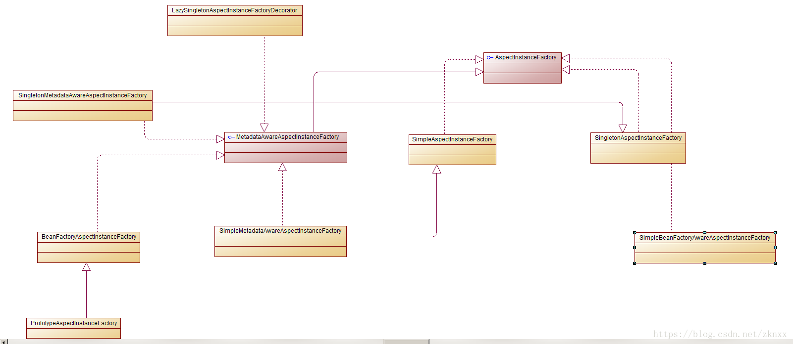
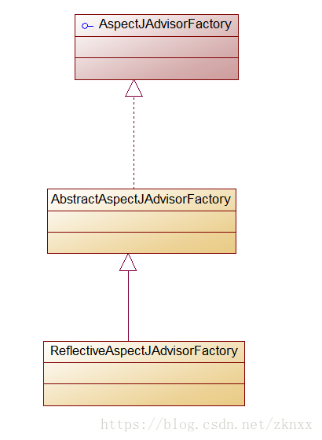

我们在这篇文章中接着上一篇文章的分析。我们在上一篇文章中分析了创建AspectJProxyFactory，并向AspectJProxyFactory中添加目标对象和获取目标对象的过程。我们在这一篇文章中分析调用addAspect方法添加切面的过程。
在AspectJProxyFactory中有两个addAspect重载方法，一个入参是切面实例对象，一个入参是切面类对象。他们两个的区别是：传入实例对象的方法会将实例对象封装为一个单例不再进行切面对象的场景，传入切面类对象的方法需要创建切面对象实例。我们分析入参为切面类对象的方法。代码如下：
```java
	public void addAspect(Class<?> aspectClass) {
		//全限定类名
		String aspectName = aspectClass.getName();
		//根据切面对象创建切面元数据类
		AspectMetadata am = createAspectMetadata(aspectClass, aspectName);
		//根据传入的切面类创建 切面实例 将切面实例封装为切面实例工厂
		MetadataAwareAspectInstanceFactory instanceFactory = createAspectInstanceFactory(am, aspectClass, aspectName);
		//从切面实例工厂中获取Advisor。
		addAdvisorsFromAspectInstanceFactory(instanceFactory);
	}
```
上面的代码只调用了createAspectMetadata、createAspectInstanceFactory、addAdvisorsFromAspectInstanceFactory这三个方法，但是这个过程却是很复杂的。我们先看createAspectMetadata这个方法。
我们先看看AspectMetadata 这个类是个什么东西。
```java
public class AspectMetadata implements Serializable {
	
	/**
	* 切面的名字 可能是类的全限定类名 也可能是Spring容器中bean的名字
	*/
	private final String aspectName;

	/**
	* 切面类 指带有切面注解的类
	*/
	private final Class<?> aspectClass;
	/**
	* 类的类型 这个是AspectJ中定义的类  存储了aspectClass类的类相关信息
	* 实现类为 AjTypeImpl
	*/
	private transient AjType<?> ajType;
	
	/**
	* Spring AOP 中的切点表达式
	*/
	private final Pointcut perClausePointcut;
}
```
AspectMetadata这个类中主要存储了切面类的名字、切面类对象和AspectJ中定义的存储切面类Class对象的类以及SpringAOP中的切点表达式。
createAspectMetadata方法的内容如下：
```java
	private AspectMetadata createAspectMetadata(Class<?> aspectClass, String aspectName) {
		//直接调用 AspectMetadata的构造函数  创建对象 入参为：切面类和切面类的全限定类名
		AspectMetadata am = new AspectMetadata(aspectClass, aspectName);
		//如果切面类不是切面则抛出异常
		//这里判断我们传入的切面类是不是切面很简单，即判断切面类上是否存在@Aspect注解。
		//这里判断一个类是不是切面类是这样进行判断的：如果我们传入的切面类上没有@Aspect注解的话，则去查找它的父类上
		//是否存在@Aspect注解。一直查到父类为Object。如果一直没有找到带有@Aspect注解的类，则会抛出异常。
		if (!am.getAjType().isAspect()) {
			throw new IllegalArgumentException("Class [" + aspectClass.getName() + "] is not a valid aspect type");
		}
		return am;
	}
```
AspectMetadata的构造函数: 在这个构造函数里主要是查找带有@Aspect注解的类。获取@Aspect类的PerClause类型。正常都是SINGLETON。
```java
	public AspectMetadata(Class<?> aspectClass, String aspectName) {
		//传入的切面类名直接赋值
		this.aspectName = aspectName;

		Class<?> currClass = aspectClass;
		AjType<?> ajType = null;
		//这里循环查找 带有Aspect的类，一直找到父类为Object
		while (currClass != Object.class) {
			AjType<?> ajTypeToCheck = AjTypeSystem.getAjType(currClass);
			if (ajTypeToCheck.isAspect()) {
				//这里的AjType所持有的aspectClass为带有@Aspect注解的类。
				//可能是我们传入的类，也可能是我们的传入类的父类 父父类。。。
				ajType = ajTypeToCheck;
				break;
			}
			//查找父类
			currClass = currClass.getSuperclass();
		}
		//如果传入的类 没有@Aspect注解 则抛出异常
		if (ajType == null) {
			throw new IllegalArgumentException("Class '" + aspectClass.getName() + "' is not an @AspectJ aspect");
		}
		//这里是检查AspectJ的注解 这里一般我们也不会用到 可以忽略掉。
		if (ajType.getDeclarePrecedence().length > 0) {
			throw new IllegalArgumentException("DeclarePrecendence not presently supported in Spring AOP");
		}
		//带有@Aspect注解的类。
		this.aspectClass = ajType.getJavaClass();
		this.ajType = ajType;
		//正常我们的Aspect类 都是SINGLETON
		//其他的是AspectJ提供的一些高级的用法 我们这里先不展开
		switch (this.ajType.getPerClause().getKind()) {
			case SINGLETON:
				this.perClausePointcut = Pointcut.TRUE;
				return;
			..............
			省略
			
		}
	}
```
我们在看createAspectInstanceFactory这个方法的内容：
```java
	private MetadataAwareAspectInstanceFactory createAspectInstanceFactory(
			AspectMetadata am, Class<?> aspectClass, String aspectName) {

		MetadataAwareAspectInstanceFactory instanceFactory;
		//前面我们分析过 我们在使用 @Aspect注解的时候 都是直接在类上添加@Aspect注解
		if (am.getAjType().getPerClause().getKind() == PerClauseKind.SINGLETON) {
			// Create a shared aspect instance.
			//根据传入的切面类创建 切面对象 是一个单例 要求有无参构造函数
			//这个获取 单例 切面对象的方式可以学习一下
			Object instance = getSingletonAspectInstance(aspectClass);
			//将上一步创建的切面对象 封装到SingletonMetadataAwareAspectInstanceFactory中
			//从名字我们也可以看出来 这是一个单例的带有切面元数据的切面实例工厂
			instanceFactory = new SingletonMetadataAwareAspectInstanceFactory(instance, aspectName);
		}
		else {
			// Create a factory for independent aspect instances.
			//这里创建一个 SimpleMetadataAwareAspectInstanceFactory 传入切面类和切面名字
			instanceFactory = new SimpleMetadataAwareAspectInstanceFactory(aspectClass, aspectName);
		}
		return instanceFactory;
	}
```
这个方法主要是创建了一个MetadataAwareAspectInstanceFactory 的子类。用来组合切面实例对象和切面元数据。面向接口编程的一个很好的体现(依赖倒转)。MetadataAwareAspectInstanceFactory有很多子类，在不同的场景下创建不同用途的实例。其UML类图如下：

我们先看创建SingletonMetadataAwareAspectInstanceFactory的构造函数：
```java
	public SingletonMetadataAwareAspectInstanceFactory(Object aspectInstance, String aspectName) {
		//将切面实例传入到父类构造函数中
		super(aspectInstance);
		//创建切面元数据 和之前的过程一下
		this.metadata = new AspectMetadata(aspectInstance.getClass(), aspectName);
	}
```
addAdvisorsFromAspectInstanceFactory这个方法，应该是我们这次要分析的重点方法了，获取Advisor的逻辑都在这个方法中。其代码如下：
```java
	private void addAdvisorsFromAspectInstanceFactory(MetadataAwareAspectInstanceFactory instanceFactory) {
		//使用ReflectiveAspectJAdvisorFactory从MetadataAwareAspectInstanceFactory中获取Advisor
		List<Advisor> advisors = this.aspectFactory.getAdvisors(instanceFactory);
		//从中挑出适用于目标对象的Advisor
		advisors = AopUtils.findAdvisorsThatCanApply(advisors, getTargetClass());
		AspectJProxyUtils.makeAdvisorChainAspectJCapableIfNecessary(advisors);
		//对获取到的Advisor进行排序
		AnnotationAwareOrderComparator.sort(advisors);
		//将获取到Advisor添加到advisors集合中
		addAdvisors(advisors);
	}
```
对于上面的代码我们一步一步的分析。先从this.aspectFactory.getAdvisors这里开始。这里的aspectFactory为ReflectiveAspectJAdvisorFactory。在SpringAOP中从Aspect中获取Advisor都是使用的ReflectiveAspectJAdvisorFactory这个类。这个类是AspectJAdvisorFactory的子类，他们的关系如下：

AbstractAspectJAdvisorFactory和ReflectiveAspectJAdvisorFactory中很重要的类。他们的重要性在我们后面的分析中会慢慢的体现出来。
ReflectiveAspectJAdvisorFactory中的getAdvisors方法内容如下：
```java
	public List<Advisor> getAdvisors(MetadataAwareAspectInstanceFactory aspectInstanceFactory) {
		//切面类  这个我们在上说过  是一个带有Aspect注解的类。不一定就是我们调用addAspect传入的类 可能是其父类
		Class<?> aspectClass = aspectInstanceFactory.getAspectMetadata().getAspectClass();
		//切面类名字
		String aspectName = aspectInstanceFactory.getAspectMetadata().getAspectName();
		//校验切面类
		validate(aspectClass);
		
		//validate方法的内容如下 主要是校验 带有Aspect注解的类查看它的父类是否也有Aspect注解并且不是抽象类
		//校验我们的切面类是否带有Aspect注解
		public void validate(Class<?> aspectClass) throws AopConfigException {
		//如果我们的带有@Aspect注解的类的父类也带有@Aspect注解并且其还不是抽象类 则抛出异常
		if (aspectClass.getSuperclass().getAnnotation(Aspect.class) != null &&
				!Modifier.isAbstract(aspectClass.getSuperclass().getModifiers())) {
			throw new AopConfigException("[" + aspectClass.getName() + "] cannot extend concrete aspect [" +
					aspectClass.getSuperclass().getName() + "]");
		}
		AjType<?> ajType = AjTypeSystem.getAjType(aspectClass);
		//再次校验 切面类是否带有 @Aspect注解
		if (!ajType.isAspect()) {
			throw new NotAnAtAspectException(aspectClass);
		}
		//下面这两个正常开发中一般遇到不
		if (ajType.getPerClause().getKind() == PerClauseKind.PERCFLOW) {
			throw new AopConfigException(aspectClass.getName() + " uses percflow instantiation model: " +
					"This is not supported in Spring AOP.");
		}
		if (ajType.getPerClause().getKind() == PerClauseKind.PERCFLOWBELOW) {
			throw new AopConfigException(aspectClass.getName() + " uses percflowbelow instantiation model: " +
					"This is not supported in Spring AOP.");
		}
	}
```
继续getAdvisors方法中下面的内容
```java
	//将我们上一步获取的MetadataAwareAspectInstanceFactory实例又包装为LazySingletonAspectInstanceFactoryDecorator
	//装饰模式的一个使用
	//确保只能获取到一个切面实例
	MetadataAwareAspectInstanceFactory lazySingletonAspectInstanceFactory =
				new LazySingletonAspectInstanceFactoryDecorator(aspectInstanceFactory);

		List<Advisor> advisors = new LinkedList<Advisor>();
		//调用getAdvisorMethods方法来获取 切面类中 所有不包含Pointcut注解的方法。
		for (Method method : getAdvisorMethods(aspectClass)) {
			//得到Advisor
			Advisor advisor = getAdvisor(method, lazySingletonAspectInstanceFactory, advisors.size(), aspectName);
			if (advisor != null) {
				advisors.add(advisor);
			}
		}
	
	//我们来看看getAdvisorMethods方法的内容
	private List<Method> getAdvisorMethods(Class<?> aspectClass) {
		final List<Method> methods = new LinkedList<Method>();
		//回调  ReflectionUtils.doWithMethods这个方法我们在Spring的代码中会经常看到
		ReflectionUtils.doWithMethods(aspectClass, new ReflectionUtils.MethodCallback() {
			//ReflectionUtils.MethodCallback的匿名实现
			@Override
			public void doWith(Method method) throws IllegalArgumentException {
				// Exclude pointcuts
				//不带Pointcut注解的方法 添加到methods集合中
				if (AnnotationUtils.getAnnotation(method, Pointcut.class) == null) {
					methods.add(method);
				}
			}
		});
		Collections.sort(methods, METHOD_COMPARATOR);
		return methods;
	}
	//ReflectionUtils.doWithMethods方法的内容
	public static void doWithMethods(Class<?> clazz, MethodCallback mc, MethodFilter mf) {
		// Keep backing up the inheritance hierarchy.
		//获取类中所有的方法
		//这里需要注意的是 这里支持JDK1.8中的新特性 可以获取到接口中的default方法
		Method[] methods = getDeclaredMethods(clazz);
		for (Method method : methods) {
			//如果传入的MethodFilter 不等于null的话，则调用它的matches方法 根据匹配规则进行匹配
			if (mf != null && !mf.matches(method)) {
				continue;
			}
			try {
				//回调前面我们定义的doWith方法
				mc.doWith(method);
			}
			catch (IllegalAccessException ex) {
				throw new IllegalStateException("Not allowed to access method '" + method.getName() + "': " + ex);
			}
		}
		//父类中的方法
		if (clazz.getSuperclass() != null) {
			doWithMethods(clazz.getSuperclass(), mc, mf);
		}
		//接口中的方法
		else if (clazz.isInterface()) {
			for (Class<?> superIfc : clazz.getInterfaces()) {
				doWithMethods(superIfc, mc, mf);
			}
		}
	}
```
剩下的内容我们下一章继续分析。
