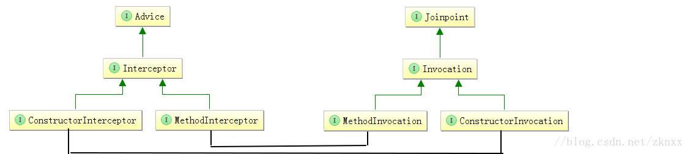

在这篇文章中我将对自己了解的AOP中的基本主要类做一个概述，可能不包括一些AOP高级用法的类以及是自己还不了解的类。会不定期的进行补充和修改。  

##SpringAOP基础解析类  

|类名|作用概述|
|---------|---------|
|AopNamespaceHandler|AOP命名空间解析类。我们在用AOP的时候，会在Spring配置文件的beans标签中引入：xmlns:aop |
|AspectJAutoProxyBeanDefinitionParser|解析&lt;aop:aspectj-autoproxy /&gt;标签的类。在AopNamespaceHandler中创建的类。|
|ConfigBeanDefinitionParser|解析&lt;aop:config /> 标签的类。同样也是在AopNamespaceHandler中创建的类。|
|AopNamespaceUtils|AOP命名空间解析工具类，在上面两个中被引用。|
|AopConfigUtils|AOP配置工具类。主要是向Spring容器中注入可以生成Advisor和创建代理对象的bean|
##AOP联盟中定义的一些类：
|类名|作用概述|
|----|----|
|Advice|AOP联盟中的一个标识接口。通知和Interceptor顶级类。我们说的各种通知类型都要实现这个接口。|
|Interceptor|AOP联盟中进行方法拦截的一个标识接口。是Advice的子类。|
|MethodInterceptor|方法拦截器。是Interceptor的一个重要子类。主要方法：invoke。入参为：MethodInvocation|
|ConstructorInterceptor|构造方法拦截器。是Interceptor的另一个重要的子类。在AOP联盟中是可以对构造方法进行拦截的。这样的场景我们应该很少用到。主要方法为:construct入参为ConstructorInvocation|
|Joinpoint|AOP联盟中的连接点类。主要的方法是：proceed()执行下一个拦截器。getThis()获取目标对象。|
|Invocation|AOP拦截的执行类。是Joinpoint的子类。主要方法：getArguments()获取参数。|
|MethodInvocation|Invocation的一个重要实现类。真正执行AOP方法的拦截。主要方法：getMethod()目标方法。|
|ConstructorInvocation|Invocation的另一个重要实现类。执行构造方法的拦截。主要方法：getConstructor()返回构造方法。|  

##SpringAOP中定义的类

|类名|作用概述|
|----|----|
|Advisor|SpringAOP中的核心类。组合了Advice。|
|PointcutAdvisor|SpringAOP中Advisor的重要子类。组合了切点(Pointcut)和Advice。|
|InstantiationModelAwarePointcutAdvisorImpl|PointcutAdvisor的一个重要实现子类。|
|DefaultPointcutAdvisor|PointcutAdvisor的另一个重要实现子类。可以将Advice包装为Advisor。在SpringAOP中是以Advisor为主线。向Advice靠拢。|
|Pointcut|SpringAOP中切点的顶级抽象类。|
|TruePointcut|Pointcut的一个重要实现类。在DefaultPointcutAdvisor中使用的是TruePointcut。在进行切点匹配的时候永远返回true|
|AspectJExpressionPointcut|Pointcut的一个重要实现类。AspectJ语法切点类。同时实现了MethodMatcher，AspectJ语法切点的匹配在这个类中完成。|
|AnnotationMatchingPointcut|Pointcut的一个重要实现类。注解语法的切点类。|
|JdkRegexpMethodPointcut|Pointcut的一个重要实现类。正则语法的切点类。|
|MethodMatcher|切点匹配连接点的地方。即类中的某个方法和我们定义的切点表达式是否匹配、能不能被AOP拦截|
|TrueMethodMatcher|用于返回true|
|AnnotationMethodMatcher|带有注解的方法的匹配器|
|JdkRegexpMethodPointcut|正则表达式|
|Advised|SpringAOP中的又一个核心类。它组合了Advisor和TargetSource即目标对象|
|ProxyConfig|SpringAOP中的一个核心类。在Advised中定义了一系列的配置接口，像：是否暴露对象、是否强制使用CGlib等。ProxyConfig是对这些接口的实现，但是ProxyConfig却不是Advised的实现类|
|AdvisedSupport|Advised的一个实现类。SpringAOP中的一个核心类。继承了ProxyConfig实现了Advised。|
|ProxyCreatorSupport|AdvisedSupport的子类。引用了AopProxyFactory用来创建代理对象。|
|ProxyFactory|ProxyCreatorSupport的子类。用来创建代理对象。在SpringAOP中用的最多。|
|ProxyFactoryBean|ProxyCreatorSupport的子类。用来创建代理对象。它实现了BeanFactoryAware、FactoryBean接口|
|AspectJProxyFactory|ProxyCreatorSupport的子类。用来创建代理对象。使用AspectJ语法。|
|ProxyFactory、ProxyFactoryBean、AspectJProxyFactory这三个类的使用场景各不相同。|但都是生成Advisor和TargetSource、代理对象的关系。|
|ProxyProcessorSupport|ProxyConfig的子类|
|AbstractAutoProxyCreator|ProxyProcessorSupport的重要子类。SpringAOP中的核心类。实现了SmartInstantiationAwareBeanPostProcessor、BeanFactoryAware接口。自动创建代理对象的类。我们在使用AOP的时候基本上都是用的这个类来进程Bean的拦截，创建代理对象。|
|AbstractAdvisorAutoProxyCreator|AbstractAutoProxyCreator的子类。SpringAOP中的核心类。用来创建Advisor和代理对象。|
|AspectJAwareAdvisorAutoProxyCreator|AbstractAdvisorAutoProxyCreator的子类。使用AspectJ语法创建Advisor和代理对象。|
|AnnotationAwareAspectJAutoProxyCreator|AspectJAwareAdvisorAutoProxyCreator的子类。使用AspectJ语法创建Advisor和代理对象的类。&lt;aop:aspectj-autoproxy /&gt;标签默认注入到SpringAOP中的BeanDefinition。|
|InfrastructureAdvisorAutoProxyCreator|AbstractAdvisorAutoProxyCreator的子类。SpringAOP中的核心类。基础建设类。Spring事务默认的创建代理对象的类。|
|TargetSource|持有目标对象的接口。|
|SingletonTargetSource|TargetSource的子类。适用于单例目标对象。|
|HotSwappableTargetSource|TargetSource的子类。支持热交换的目标对象|
|AbstractRefreshableTargetSource|TargetSource的子类。支持可刷新的热部署的目标对象。|
|AbstractBeanFactoryBasedTargetSource|TargetSource的子类。实现了BeanFactoryAware接口。|
|SimpleBeanTargetSource|AbstractBeanFactoryBasedTargetSource的子类。从BeanFactory中获取单例Bean。|
|LazyInitTargetSource|AbstractBeanFactoryBasedTargetSource的子类。从BeanFactory中获取单例Bean。支持延迟初始化。|
|AbstractPrototypeBasedTargetSource|AbstractBeanFactoryBasedTargetSource的子类。对Prototype类型的Bean的支持。|
|ThreadLocalTargetSource|AbstractPrototypeBasedTargetSource的子类。和线程上下文相结合的类。|
|PrototypeTargetSource|AbstractPrototypeBasedTargetSource的子类。从BeanFacory中获取Prototype类型的Bean。|
|AopProxy|生成AOP代理对象的类。|
|JdkDynamicAopProxy|AopProxy的子类。使用JDK的方式创建代理对象。它持有Advised对象。|
|CglibAopProxy|AopProxy的子类。使用Cglib的方法创建代理对象。它持有Advised对象。|
|ObjenesisCglibAopProxy|CglibAopProxy的子类。使用Cglib的方式创建代理对象。它持有Advised对象。|
|AopProxyFactory|创建AOP代理对象的工厂类。选择使用JDK还是Cglib的方式来创建代理对象。|
|DefaultAopProxyFactory|AopProxyFactory的子类，也是SpringAOP中唯一默认的实现类。|
|AdvisorChainFactory|获取Advisor链的接口。|
|DefaultAdvisorChainFactory|AdvisorChainFactory的实现类。也是SpringAOP中唯一默认的实现类。|
|AdvisorAdapterRegistry|Advisor适配注册器类。用来将Advice适配为Advisor。将Advisor适配为MethodInterceptor。|
|DefaultAdvisorAdapterRegistry|AdvisorAdapterRegistry的实现类。也是SpringAOP中唯一默认的实现类。持有：MethodBeforeAdviceAdapter、AfterReturningAdviceAdapter、ThrowsAdviceAdapter实例。|
|AutoProxyUtils|SpringAOP自动创建代理对象的工具类。|
|BeforeAdvice|前置通知类。直接继承了Advice接口。|
|MethodBeforeAdvice|BeforeAdvice的子类。定义了方法before。执行前置通知。|
|MethodBeforeAdviceInterceptor|MethodBefore前置通知Interceptor。实现了MethodInterceptor接口。持有MethodBefore对象。|
|AfterAdvice|后置通知类。直接继承了Advice接口。|
|ThrowsAdvice|后置异常通知类。直接继承了AfterAdvice接口。|
|AfterReturningAdvice|后置返回通知类。直接继承了AfterAdvice接口。|
|AfterReturningAdviceInterceptor|后置返回通知Interceptor。实现了MethodInterceptor和AfterAdvice接口。持有AfterReturningAdvice实例|
|ThrowsAdviceInterceptor|后置异常通知Interceptor。实现了MethodInterceptor和AfterAdvice接口。要求方法名为：afterThrowing|
|AdvisorAdapter|Advisor适配器。判断此接口的是不是能支持对应的Advice。五种通知类型，只有三种通知类型适配器。这里可以想一下为什么只有三种。|
|MethodBeforeAdviceAdapter|前置通知的适配器。支持前置通知类。有一个getInterceptor方法：将Advisor适配为MethodInterceptor。Advisor持有Advice类型的实例，获取MethodBeforeAdvice，将MethodBeforeAdvice适配为MethodBeforeAdviceInterceptor。AOP的拦截过程通过MethodInterceptor来完成。|
|AfterReturningAdviceAdapter|后置返回通知的适配器。支持后置返回通知类。有一个getInterceptor方法：将Advisor适配为MethodInterceptor。Advisor持有Advice类型的实例，获取AfterReturningAdvice，将AfterReturningAdvice适配为AfterReturningAdviceInterceptor。AOP的拦截过程通过MethodInterceptor来完成。|
|ThrowsAdviceAdapter|后置异常通知的适配器。支持后置异常通知类。有一个getInterceptor方法：将Advisor适配为MethodInterceptor。Advisor持有Advice类型的实例，获取ThrowsAdvice，将ThrowsAdvice适配为ThrowsAdviceInterceptor。AOP的拦截过程通过MethodInterceptor来完成。|
|AbstractAspectJAdvice|使用AspectJ注解的通知类型顶级父类|
|AspectJMethodBeforeAdvice|使用AspectJ Before注解的前置通知类型。实现了MethodBeforeAdvice继承了AbstractAspectJAdvice。|
|AspectJAfterAdvice|使用AspectJ After注解的后置通知类型。实现了MethodInterceptor、AfterAdvice接口。继承了AbstractAspectJAdvice。|
|AspectJAfterReturningAdvice|使用AspectJ AfterReturning注解的后置通知类型。实现了AfterReturningAdvice、AfterAdvice接口。继承了AbstractAspectJAdvice。|
|AspectJAroundAdvice|使用AspectJ Around注解的后置通知类型。实现了MethodInterceptor接口。继承了AbstractAspectJAdvice。|
|AspectJAfterThrowingAdvice|使用AspectJ Around注解的后置通知类型。实现了MethodInterceptor、AfterAdvice接口。继承了AbstractAspectJAdvice。|
|AspectJAdvisorFactory|使用AspectJ注解 生成Advisor工厂类|
|AbstractAspectJAdvisorFactory|AspectJAdvisorFactory的子类。使用AspectJ注解 生成Advisor的工厂类|
|ReflectiveAspectJAdvisorFactory|AbstractAspectJAdvisorFactory的子类。使用AspectJ注解 生成Advisor的具体实现类。|
|AspectMetadata|使用AspectJ Aspect注解的切面元数据类。|
|BeanFactoryAspectJAdvisorsBuilder|工具类。负责构建Advisor、Advice。SpringAOP核心类|
|AspectInstanceFactory|Aspect实例工厂类|
|MetadataAwareAspectInstanceFactory|AspectInstanceFactory的子类。含有Aspect注解元数据 Aspect切面实例工厂类。|
|BeanFactoryAspectInstanceFactory|MetadataAwareAspectInstanceFactory的子类。持有BeanFactory实例。从BeanFactory中获取Aspect实例。|
|PrototypeAspectInstanceFactory|BeanFactoryAspectInstanceFactory的子类。获取Prototype类型的Aspect实例。|
|SimpleMetadataAwareAspectInstanceFactory|MetadataAwareAspectInstanceFactory的实例。在AspectJProxyFactory中有使用。|
|SingletonMetadataAwareAspectInstanceFactory|MetadataAwareAspectInstanceFactory的子类。继承了SimpleAspectInstanceFactory。单例Aspect实例类。在AspectJProxyFactory中有使用。|
|SimpleBeanFactoryAwareAspectInstanceFactory|AspectInstanceFactory的子类。实现了BeanFactoryAware接口。和&lt;aop:config>配合使用的类。|
|ProxyMethodInvocation|含有代理对象的。MethodInvocation的子类。|
|ReflectiveMethodInvocation|ProxyMethodInvocation的子类。AOP拦截的执行入口类。|
|CglibMethodInvocation|ReflectiveMethodInvocation的子类。对Cglib反射调用目标方法进行了一点改进。|
